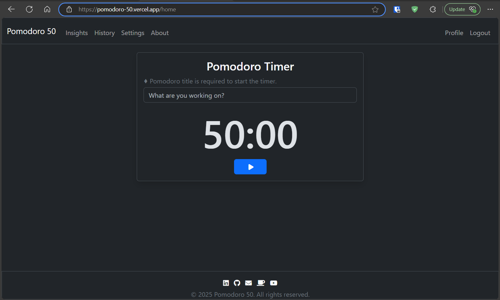

# Pomodoro 50

	

## Overview

Pomodoro 50 is a Flask web app I built as a final project for **CS50x 2024**. The app uses the 50-minute Pomodoro session, but you can adjust it. It also includes Gemini AI that gives a little motivational push if you pause for questionable reasons. It’s a small experiment in combining habit-building with light AI interaction.

## Links

Website: [https://pomodoro-50.vercel.app/home](https://pomodoro-50.vercel.app/home)
YouTube: [https://youtu.be/HSemsQzqEoQ](https://youtu.be/HSemsQzqEoQ)
Pomofocus: [https://pomofocus.io/](https://pomofocus.io/)

## Notes

The website is hosted on Vercel free tier, so it may take a few seconds to load or just not work at all.
